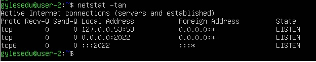
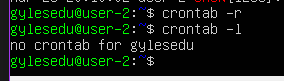

# Операционные системы UNIX/Linux (Базовый).

Установка и обновления системы Linux. Основы администрирования.


## Contents
1. [Chapter I](#chapter-i)
2. [Chapter II](#chapter-ii) \
    2.1. [Linux](#linux)  
    2.2. [Администрирование](#администрирование)  
    2.3. [Виртуальные машины](#виртуальные-машины) 
3. [Chapter III](#chapter-iii) \
    3.1 [Установка ОС](#part-1-установка-ос)  
    3.2 [Создание пользователя](#part-2-создание-пользователя)  
    3.3 [Настройка сети ОС](#part-3-настройка-сети-ос)   
    3.4 [Обновление ОС](#part-4-обновление-ос)  
    3.5 [Использование команды  sudo](#part-5-использование-команды-sudo)  
    3.6 [Установка и настройка службы времени](#part-6-установка-и-настройка-службы-времени)  
    3.7 [Установка и использование текстовых редакторов](#part-7-установка-и-использование-текстовых-редакторов)  
    3.8 [Установка и базовая настройка сервиса SSHD](#part-8-установка-и-базовая-настройка-сервиса-sshd)   
    3.9 [Установка и использование утилит top, htop](#part-9-установка-и-использование-утилит-top-htop)   
    3.10 [Использование утилиты fdisk](#part-10-использование-утилиты-fdisk)   
    3.11 [Использование утилиты df](#part-11-использование-утилиты-df)    
    3.12 [Использование утилиты du](#part-12-использование-утилиты-du)    
    3.13 [Установка и использование утилиты ncdu](#part-13-установка-и-использование-утилиты-ncdu)    
    3.14 [Работа с системными журналами](#part-14-работа-с-системными-журналами)     
    3.15 [Использование планировщика заданий CRON](#part-15-использование-планировщика-заданий-cron)    


## Part 1. Установка ОС

**== Задание ==**

##### Установить **Ubuntu 20.04 Server LTS** без графического интерфейса. (Используем программу для виртуализации - VirtualBox)

- Графический интерфейс должен отсутствовать.

- Узнайте версию Ubuntu, выполнив команду \
`cat /etc/issue.`
- Вставьте скриншот с выводом команды.

**== Выполнение задания ==**

- Выполнив команду `cat /etc/issue.`, проверим версию установленной Ubuntu. <br>


## Part 2. Создание пользователя

**== Задание ==**

##### Создать пользователя, отличного от пользователя, который создавался при установке. Пользователь должен быть добавлен в группу `adm`.

- Вставьте скриншот вызова команды для создания пользователя.
- Новый пользователь должен быть в выводе команды \
`cat /etc/passwd`
- Вставьте скриншот с выводом команды.

**== Выполнение задания ==**

- Создадим нового пользователя `liubasik` с помощью команды `sudo adduser liubasik`<br>


- При выводе команды `cat /etc/passwd` новый пользователь liubasik также отображается. <br>


- Добавим пользователя `liubasik` в группу `adm` и проверим группы пользователя с помощью команды `groups`. <br>


## Part 3. Настройка сети ОС

**== Задание ==**

##### Задать название машины вида user-1  
##### Установить временную зону, соответствующую вашему текущему местоположению.  
##### Вывести названия сетевых интерфейсов с помощью консольной команды.
- В отчёте дать объяснение наличию интерфейса lo.  
##### Используя консольную команду получить ip адрес устройства, на котором вы работаете, от DHCP сервера. 
- В отчёте дать расшифровку DHCP.  
##### Определить и вывести на экран внешний ip-адрес шлюза (ip) и внутренний IP-адрес шлюза, он же ip-адрес по умолчанию (gw). 
##### Задать статичные (заданные вручную, а не полученные от DHCP сервера) настройки ip, gw, dns (использовать публичный DNS серверы, например 1.1.1.1 или 8.8.8.8).  
##### Перезагрузить виртуальную машину. Убедиться, что статичные сетевые настройки (ip, gw, dns) соответствуют заданным в предыдущем пункте.  
##### Успешно пропинговать удаленные хосты 1.1.1.1 и ya.ru и вставить в отчёт скрин с выводом команды. В выводе команды должна быть фраза "0% packet loss".

- В отчёте опишите, что сделали для выполнения всех семи пунктов (можно как текстом, так и скриншотами).
- Успешно пропинговать удаленные хосты 1.1.1.1 и ya.ru и вставить в отчёт скрин с выводом команды. В выводе команды должна быть фраза "0% packet loss".

**== Выполнение задания ==**

- При вызове команды `hostname` отображается имя `gylesedu-server`, заданное при установке ОС. 
С помощью команды `sudo hostname user-1` название машины измения на `user-1`.
При повторном вызове `hostname` получаем новое название - `user-1`, что и показано на скриншоте. <br>


- Однако, после выполнения команды `sudo reboot` название машины сбросится. Проверим: <br>


- Поэтому прдлагается альтернативный вариант: <br>


- После выполнения `sudo reboot` изменения сохранятся и название машины будет отображаться, как `user-1`. <br>

---
- Далее, проверим текущюю временную зону. Как можно увидеть, она не соответствует текущему местоположению. <br>


- Установим временную зону `Europe/Moscow` и выполним проверку. <br>


---
- Выведем названия сетевых интерфейсов с помощью консольной команды `ip list show` или `ip address`. <br>


> **lo (loopback device)** – виртуальный интерфейс, присутствующий по умолчанию в любом Linux. Он используется для отладки сетевых программ и запуска серверных приложений на локальной машине. С этим интерфейсом всегда связан адрес 127.0.0.1. У него есть dns-имя – localhost. 
---
- Используя консольную команду `cat /var/log/syslog | grep -i 'dhcp'`, получим ip адрес устройства, на котором оно работает, от DHCP сервера. <br>

Как видно на скриншоте, DHCP выдал устройству ip адрес `10.0.2.15/24`. <br>

> **DHCP** – Dynamic Host Configuration Protocol (протокол динамической конфигурации хоста). Это механизм динамической выдачи IP-адресов в сети. IP-адрес (Internet Protocol) - способ адрессации устройств по сети. У каждого устройства свой уникальный ip-адрес. Без DHCP-сервера, администратору пришлось бы вручную настраивать статический IP-адрес каждого устройства, что при большом количестве устройст могло бы привести к ошибке. 

---
- Определить и вывести на экран внешний ip-адрес шлюза (ip) и внутренний IP-адрес шлюза, он же ip-адрес по умолчанию (gw). 
> Шлюз - это один из типов маршрутизаторов. Маршрутизаторы соединяют несколько сетей и выполняют функции маршрутизации пакетов. Шлюзы осуществляют маршрутизацию на сетевом уровне.

- Один из способов узнать внешний ip-адрес устройства - это команда `curl ifconfig.co`. <br>

- Также можно с помощью `curl ipecho.net`. <br>


- внутренний ip-адрес можно узнать следующим способом. <br>


== В чем разница между внутренним и внешним ip-адресами шлюза? ==
> Как внешний, так и внутренний ip-адреса предназначены для одной цели, но разница в области видимости. Внешний адрес шлюза используется по всему Интернету, когда внутренний используется только в приватной сети к устройстам, подключенным к ней.

---

- Зададим статичные (заданные вручную, а не полученные от DHCP сервера) настройки ip, gw, dns (использовав публичный DNS серверы, например 1.1.1.1 или 8.8.8.8). 

* Протокол DHCP автоматически присваивает устройству IP. Прежде чем продолжим, необходимо отключить облачную инициализацию. Для этого нужно открыть файл конфигурации `subiquity-disable-cloudinit-networking.cfg` в каталоге `/etc/cloud/cloud.cfg.d/`

`sudo vim /etc/cloud/cloud.cfg.d/subiquity-disable-cloudinit-networking.cfg`
- Проверим, что `config:disabled`. <br>


- Затем перейдем к файлу конфигурации Netplan. В данном случае это файл `00-installer-config.yaml`.

- Откроем файл в текстовом редакторе vim с помощью команды `sudo vim /etc/netplan/00-installer-config.yaml`. <br>


- Зададим статические настройки. <br>


- Для применения изменений используем команду ***netplan apply***
- Перезагружаем виртуальную машину командой ***reboot***
- Проверяем, остались ли настройки заданными. <br>


----
- Успешно пропинговать удаленные хосты 1.1.1.1 и ya.ru и вставить в отчёт скрин с выводом команды. В выводе команды должна быть фраза "0% packet loss". <br>


> Ping — утилита для проверки целостности и качества соединений в сетях. Утилита отправляет запросы указанному узлу сети и фиксирует поступающие ответы. Время между отправкой запроса и получением ответа позволяет определять двусторонние задержки по маршруту и частоту потери пакетов, то есть косвенно определять загруженность на каналах передачи данных и промежуточных устройствах.

## Part 4. Обновление ОС

**== Задание ==**

##### Обновить системные пакеты до последней на момент выполнения задания версии.  

- После обновления системных пакетов, если ввести команду обновления повторно, должно появится сообщение, что обновления отсутствуют.
- Вставить скриншот с этим сообщением в отчёт.

**== Выполнение задания ==**
- Выполним `sudo apt update` и `sudo apt upgrade`
- Повторно вызовем команды и получим сообщение об отсутствии новых обновлений. <br>


## Part 5. Использование команды **sudo**

**== Задание ==**

##### Разрешить пользователю, созданному в [Part 2](#part-2-создание-пользователя), выполнять команду sudo.

- В отчёте объяснить *истинное* назначение команды sudo (про то, что это слово - "волшебное", писать не стоит).  
- Поменять hostname ОС от имени пользователя, созданного в пункте [Part 2](#part-2-создание-пользователя) (используя sudo).
- Вставить скрин с изменённым hostname в отчёт.

**== Выполнение задания ==**
- Назначение команды sudo
>  Команда sudo - **substitute user and do**, подменить пользователя и выполнить. Главное назначение **sudo** — это выполнить команду от имени другого пользователя, обычно от root. Смысл выполнения команды от root в том, что у него повышенные права доступа и, применяя sudo, обычный пользователь может выполнить те действия, на которые у него недостаточно прав.
---
- Сперва убедимся, что у пользователя `liubasik` отсутствуют права sudo. <br>

- Наделим пользователя правами sudo. <br>

- Сменим пользователя на liubasik. <br>

- Выполним изменение названия машины и проверку сохранения изменений. После этого вызовем `reboot`. <br>


## Part 6. Установка и настройка службы времени

**== Задание ==**

##### Настроить службу автоматической синхронизации времени.  

- Вывести время, часового пояса, в котором вы сейчас находитесь.
- Вывод следующей команды должен содержать `NTPSynchronized=yes`: \
  `timedatectl show`
- Вставить скрины с корректным временем и выводом команды в отчёт.

**== Выполнение задания ==**
- Настройки часового пояса. <br>


## Part 7. Установка и использование текстовых редакторов 

**== Задание ==**

##### Установить текстовые редакторы **VIM** (+ любые два по желанию **NANO**, **MCEDIT**, **JOE** и т.д.)  
##### Используя каждый из трех выбранных редакторов, создайте файл *test_X.txt*, где X -- название редактора, в котором создан файл. Напишите в нём свой никнейм, закройте файл с сохранением изменений.  
- В отчёт вставьте скриншоты:
  - Из каждого редактора с содержимым файла перед закрытием.
- В отчёте укажите, что сделали для выхода с сохранением изменений.
##### Используя каждый из трех выбранных редакторов, откройте файл на редактирование, отредактируйте файл, заменив никнейм на строку "21 School 21", закройте файл без сохранения изменений.
- В отчёт вставьте скриншоты:
    - Из каждого редактора с содержимым файла после редактирования.
- В отчёте укажите, что сделали для выхода без сохранения изменений.
##### Используя каждый из трех выбранных редакторов, отредактируйте файл ещё раз (по аналогии с предыдущим пунктом), а затем освойте функции поиска по содержимому файла (слово) и замены слова на любое другое.
- В отчёт вставьте скриншоты:
    - Из каждого редактора с результатами поиска слова.
    - Из каждого редактора с командами, введёнными для замены слова на другое.

**== Выполнение задания ==**
- Установка текстовых редакторов.<br>
`sudo apt install vim`<br>
`sudo apt install nano`<br>
`sudo apt install mcedit`

### Запись никнейма в файлы и закрытие с сохранением

- **VIM**
 <br>
Для выхода с сохранением нужно нажать Esc, затем написать `:wq`, что означает write and quit.

- **NANO**
 <br>
Для выхода с сохранением нужно выполнить `Ctrl+S` и `Ctrl+X`

- **MCEDIT**
 <br>
Для выхода с сохранением необходимо нажать F10 и выбрать yes.
 <br>
---

### Запись текста "21 School 21" в файлы и выход без сохранения

- **VIM**
 <br>
Для выхода без сохранения нужно нажать Esc, затем написать `:q!`. Проверим, что изменения не сохранились.
 <br>

- **NANO**
 <br>
Для выхода без сохранения нужно нажать Esc, затем написать `:q!`. Проверим, что изменения не сохранились.
 <br>
- **MCEDIT**
 <br>
Для выхода без сохранения нужно нажать F10, затем выбрать No.
 <br>
Проверим, что изменения не сохранились.
 <br>

---
### Поиск по слову в файлах
- Внесем те же изменения, что и в прошлом пункте, но сохраним файлы.
- **VIM** <br>
Поиск: <br>
Esc + `/<word_to_search>` <br>

Замена: <br>
`:%s/<change_this>/<to_this>` <br>


- **NANO** <br>
Поиск: <br>
`Ctrl + W` <br>

Замена:
`Ctrl + \` <br>


- **MCEDIT**
Поиск: <br>
`F7`


Замена: <br>
`F4`


## Part 8. Установка и базовая настройка сервиса **SSHD**

**== Задание ==**

##### Установить службу SSHd.  
##### Добавить автостарт службы при загрузке системы.  
##### Перенастроить службу SSHd на порт 2022.  
##### Используя команду ps, показать наличие процесса sshd. Для этого к команде нужно подобрать ключи.
- В отчёте объяснить значение команды и каждого ключа в ней.
##### Перезагрузить систему.
- В отчёте опишите, что сделали для выполнения всех пяти пунктов (можно как текстом, так и скриншотами).
- Вывод команды netstat -tan должен содержать  \
`tcp 0 0 0.0.0.0:2022 0.0.0.0:* LISTEN`  \
(если команды netstat нет, то ее нужно установить)
- Скрин с выводом команды вставить в отчёт.
- В отчёте объяснить значение ключей -tan, значение каждого столбца вывода, значение 0.0.0.0.

**== Выполнение задания ==**
- Установим службу SSHd с помощью команды `sudo apt install openssh-server`.
- Автоматически SSHd автостарт службы добавлен при загрузке системы. 
 <br>
-Изменить автостарт можно с помощью команд `sudo systemctl disable ssh` или `sudo systemctl enable ssh`. <br>

- Для перенаструйти службы SSHd откроем файл `sshd_config` командой `sudo nano /etc/ssh/sshd_config`.

По умолчанию порт задан 22. Изменим на 2022

- Используя команду ps, покажем наличие процесса sshd.<br>

> **ax** – будут показаны все процессы подробно. **u** — выводит пользователя и еще доп информацию. **grep sshd** выводит только те строчки, где есть **sshd**
- Выполним reboot и `netstat -tan`

> **netstat -tan** <br>
Команда netstat показывает статистику приема и отправки пакетов, а также информацию об ошибках приема и отправки. <br>
**-a** - Вывод всех активных подключений TCP и прослушиваемых компьютером портов TCP и UDP. <br>
**-n** - Вывод активных подключений TCP с отображением адресов и номеров портов в числовом формате без попыток определения имен.  <br>
Тогда, если **netstat -na** - просмотр всех открытых протоколов, то **netstat -tan** - просмотр всех открытых ТСР-протоколов.

## Part 9. Установка и использование утилит **top**, **htop**

**== Задание ==**

##### Установить и запустить утилиты top и htop.  

- По выводу команды top определить и написать в отчёте:
  - uptime
  - количество авторизованных пользователей
  - общую загрузку системы
  - общее количество процессов
  - загрузку cpu
  - загрузку памяти
  - pid процесса занимающего больше всего памяти
  - pid процесса, занимающего больше всего процессорного времени
- В отчёт вставить скрин с выводом команды htop:
  - отсортированному по PID, PERCENT_CPU, PERCENT_MEM, TIME
  - отфильтрованному для процесса sshd
  - с процессом syslog, найденным, используя поиск 
  - с добавленным выводом hostname, clock и uptime
  
**== Выполнение задания ==**
- Команда top выдает следующий результат:

  - uptime - 12 минут
  - количество авторизованных пользователей - 1
  - общую загрузку системы - 0.00
  - общее количество процессов - 94
  - загрузку cpu - 0.3 %
  - загрузку памяти - 147.6 из 1983.4
  - pid процесса занимающего больше всего памяти 1
  - pid процесса, занимающего больше всего процессорного времени - 1074 
- htop
  - htop сортируется следующим образом: `htop --sort-key PID`
    - htop, отсортированный по PID 
    
    - htop, отсортированный по PERCENT_CPU
    
    - htop, отсортированный по PERCENT_MEM
    
    - htop, отсортированный по TIME
    
  - htop, отфильтрованный для процесса sshd
  
  - htop с процессом syslog, найденным, используя поиск
  
  - htop с добавленным выводом hostname, clock и uptime
  
## Part 10. Использование утилиты **fdisk**

**== Задание ==**

##### Запустить команду fdisk -l.

- В отчёте написать название жесткого диска, его размер и количество секторов, а также размер swap.

**== Выполнение задания ==**

```
- Название диска: VBOX HARDDISK
- Размер диска: 10 Гигабайт
- Количество секторов: 20971520
- Размер swap: 512 байт
```
## Part 11. Использование утилиты **df** 

**== Задание ==**

##### Запустить команду df.  
- В отчёте написать для корневого раздела (/):
  - размер раздела
  - размер занятого пространства
  - размер свободного пространства
  - процент использования
- Определить и написать в отчёт единицу измерения в выводе. 

##### Запустить команду df -Th.
- В отчёте написать для корневого раздела (/):
    - размер раздела
    - размер занятого пространства
    - размер свободного пространства
    - процент использования
- Определить и написать в отчёт тип файловой системы для раздела.

**== Выполнение задания ==** 
- df
  
  ```
  для корневого раздела (/):
  - размер раздела - 8408452
  - размер занятого пространства - 4228716
  - размер свободного пространства - 3731020
  - процент использования 54%
  - единица измерения - Килобайт.
  ```
- df -Th
  
  ```
  для корневого раздела (/):
  - размер раздела - 8.1
  - размер занятого пространства - 4.1
  - размер свободного пространства - 3.6
  - процент использования 54%
  - единица измерения - Гб.
  ```
## Part 12. Использование утилиты **du**

**== Задание ==**

##### Запустить команду du.
##### Вывести размер папок /home, /var, /var/log (в байтах, в человекочитаемом виде)
##### Вывести размер всего содержимого в /var/log (не общее, а каждого вложенного элемента, используя *)

- В отчёт вставить скрины с выводом всех использованных команд.

**== Выполнение задания ==** 
  - du <br>
    
  - размер папок /home в байтах и человекочитаемом виде. <br>
  
  - размер папок /var в байтах и человекочитаемом виде. <br>
  
  - размер папок /var/log в байтах и человекочитаемом виде. <br>
  
  - размер всего содержимого в /var/log.
  
## Part 13. Установка и использование утилиты **ncdu**

**== Задание ==**

##### Установить утилиту ncdu.
##### Вывести размер папок /home, /var, /var/log.

- Размеры должны примерно совпадать с полученными в [Part 12](#part-12-использование-утилиты-du).

- В отчёт вставить скрины с выводом использованных команд.

**== Выполнение задания ==** 
- /home <br>

- /var <br>

- /var/log <br>


## Part 14. Работа с системными журналами

**== Задание ==**

##### Открыть для просмотра:
##### 1. /var/log/dmesg
##### 2. /var/log/syslog
##### 3. /var/log/auth.log  

- Написать в отчёте время последней успешной авторизации, имя пользователя и метод входа в систему.
- Перезапустить службу SSHd.
- Вставить в отчёт скрин с сообщением о рестарте службы (искать в логах).

**== Выполнение задания ==** 
- **/var/log/dmesg** <br>
/var/log/dmesg — драйвера устройств. Одноименной командой можно просмотреть вывод содержимого файла. Размер журнала ограничен, когда файл достигнет своего предела, старые сообщения будут перезаписаны более новыми. 

- **/var/log/syslog** <br>
/var/log/syslog содержит глобальный системный журнал, в котором пишутся сообщения с момента запуска системы, от ядра Linux, различных служб, обнаруженных устройствах, сетевых интерфейсов и много другого.

- **/var/log/auth.log** <br>
var/log/auth.log — информация об авторизации пользователей, включая удачные и неудачные попытки входа в систему, а также задействованные механизмы аутентификации.

- последня успешная авторизация: Mar 28 09:32:00
- имя пользователя: gylesedu
- метод входа в систему: by uid = 0 (User Identifier). Суперпользователь всегда должен иметь UID, равный нулю (0).

- Перезапуск службу SSHd.<br> `systemctl restart ssh`
- скрин с сообщением о рестарте службы:

## Part 15. Использование планировщика заданий **CRON**

**== Задание ==**

##### Используя планировщик заданий, запустите команду uptime через каждые 2 минуты.
- Найти в системных журналах строчки (минимум две в заданном временном диапазоне) о выполнении.
- Вывести на экран список текущих заданий для CRON.
- Вставить в отчёт скрины со строчками о выполнении и списком текущих задач.

##### Удалите все задания из планировщика заданий.
- В отчёт вставьте скрин со списком текущих заданий для CRON.

**== Выполнение задания ==** 
- **crontab -e**

- **crontab -l**

- **uptime** каждые 2 минуты:

- **crontab -r**

